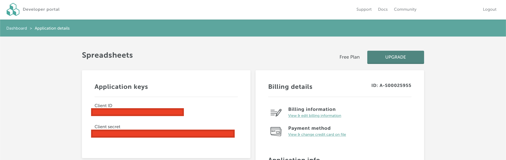

# SheetsToEmail  
### **Convert your Google spreadsheets to beautiful HTML emails**
Link to application: [sheetstoemail.com](https://sheetstoemail.com)
## Requirements
* Python 3.7
* [Google Console Application](https://console.developers.google.com)
* [Free Beeplugin account](https://beefree.io/login/)
* [Heroku Account(Optional)](https://heroku.com/)
## How does it work?
1. Login via Google

2. Copy your spreadsheet link

3. Paste

3.  Create an HTML template where {{value}} corresponds to the necessary column in your spreadsheet. Click on any save button to save your template

4. Click on "send messages" to to send your email to people

5. That's it, just wait for email sending!

6. (Optional) Customize your SMTP (by default we will send all emails to users via our SMTP server("notification@planeks.net"), if you want to send emails using your email(for example "noreply@mycompanyname.com"), you need specify these SMTP settings.


## How to setup it?
### Create the Google Console App

1. Go to [Google Console](https://console.developers.google.com)
2. Create new project(Use any name)


3. Go to [Api and Services](https://console.developers.google.com/apis/dashboard)


4. Create PUBLIC consent screen, put your server details(can be localhost:8000 too)


5. Go to credentials -> Create credentials(Oauth Client) -> Create web application


6. Fill all inputs with data as showed on the photo


7. Write down client id and secret


### Create Beeplugin Account
1. Go to [Sign Up Page](https://developers.beefree.io/accounts/signup/)
2. Create an Email builder app with a free plan


3. Go to app details and write down your client id and client secret


##### Now you can setup application on your local machine or heroku:

### Setup Django App on local machine
1. Clone repository
2. Create virtualenv and activate it
```sh
$ pip install virtualenv
$ python3 -m venv venv
# If you use mac os:
$ souce venv/bin/activate
# If you use linux:
$ . venv/bin/activate
# If you use windows:
$ venv/Scripts/activate
```
3. Install requirements
```sh
$ pip install -r requirements.txt
```
4. Create .env file in the main directory and fill your data as showed:
```
PROD=False
EMAIL_HOST_USER=your_email_here
EMAIL_HOST_PASSWORD=your_password_here
DEFAULT_FROM_EMAIL=your_email_here
REDIS_URL=redis://localhost:6379/0
EMAIL_HOST=smtp.gmail.com
BEEPLUGIN_CLIENT_ID=your_data_here
BEEPLUGIN_CLIENT_SECRET=your_data_here
SECRET_KEY=just_type_anything_here
DOMAIN=127.0.0.1
GOOGLE_CLIENT_ID=your_data_here
GOOGLE_CLIENT_SECRET=your_data_here
```

5. Fill data as showed(Use your google and beeplugin credentials). Also, you need to create an SMTP account such as Mailgun/Sendgrid/Gmail. [Here](https://medium.com/@_christopher/how-to-send-emails-with-python-django-through-google-smtp-server-for-free-22ea6ea0fb8e) is an example of how to use Gmail 
6. Run ```redis-server``` to start Redis server
7. Run ``celery -A config worker -l INFO`` for sending emails using Redis
8. Run migrations and create the admin account
```sh
$ python manage.py setup
$ python manage.py createsuperuser
```
9. Login as admin and check if google application is created with your credentials and your domain(If suddenly not, please try `python manage.py setup` again or fill your data manually)


10. Logout


11. Go to login page


12. That's it! Enjoy!

## Deploy Django App on Heroku
1. Clone repository
2. Delete ``.env`` from ``.gitignore``
3. Create a .env file in the main directory and fill your data as shown:
```
PROD=False
EMAIL_HOST_USER=your_email_here
EMAIL_HOST_PASSWORD=your_password_here
DEFAULT_FROM_EMAIL=your_email_here
REDIS_URL=redis://localhost:6379/0
EMAIL_HOST=smtp.gmail.com
BEEPLUGIN_CLIENT_ID=your_data_here
BEEPLUGIN_CLIENT_SECRET=your_data_here
SECRET_KEY=just_type_anything_here
DOMAIN=your_domain_here
GOOGLE_CLIENT_ID=your_data_here
GOOGLE_CLIENT_SECRET=your_data_here
HEROKU=True
```
4. Install Heroku:
For Linux:
```sh
$ sudo snap install heroku --classic
```
For Mac os:
```sh
$ brew install heroku/brew/heroku
```
For Windows:

Go to [this page](https://devcenter.heroku.com/articles/heroku-cli) and download Heroku CLI

5. Use the heroku login command to log in to the Heroku CLI(If you do not have an account, [sign up](https://signup.heroku.com/login))
```sh
$ heroku login
```
6. Create an app on Heroku, which prepares Heroku to receive your source code
```sh
$ heroku create
```
7. Push local repository files to the remote one
```sh
$ git push heroku master
```
8. Go to your [heroku](https://dashboard.heroku.com) application configuration
9. Choose your application(it will have a strange name such as dada31d-1231)


10. Go to settings


11. Change application name if you want


12. If you changed an application name, please run this command in terminal
```sh
$ heroku git:remote -a your_new_application_name
# In my case:
$ heroku git:remote -a sheetstoemail
```
13. Return to settings and reveal Config Vars


14. Fill all data here as shown on the photo(use your data).``PROD=True`` means that we use production settings, also we recommend leaving ``DEBUG=True`` in case if something will go wrong(you can switch


15. Add Heroku Redis addon


16. Run Celery


17. Run migrations and create the admin account
```sh
$ heroku run python manage.py setup
$ heroku run python manage.py createsuperuser
```
18. Login as admin and check if google application is created with your credentials and your domain(If suddenly not, please try `heroku run python manage.py setup` again or fill your data manually)


19. Logout

20. Go to login page

21. That's it! Enjoy! 
